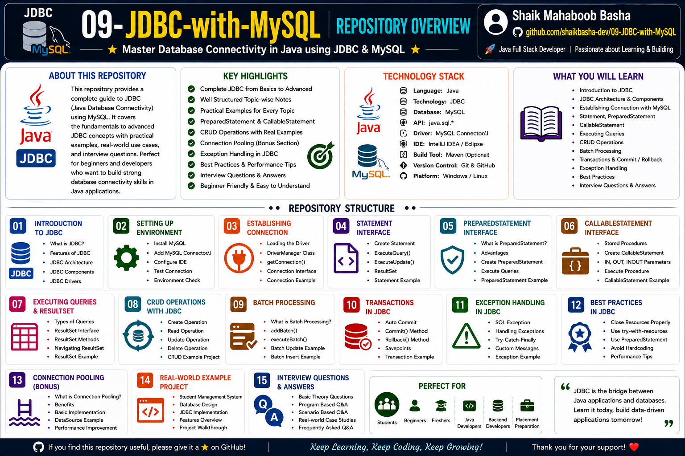

<div align="center">

# JDBC with MySQL

### A Comprehensive Learning Repository for Java Database Connectivity (JDBC)

<p align="center">
A structured educational repository covering JDBC fundamentals, Java–MySQL database connectivity, CRUD operations, batch processing, transaction management, multi-DBMS integration, practical source code examples, and interview preparation.
</p>



</div>

---

<p align="center">


</p>

---

# Table of Contents

- [About the Repository](#about-the-repository)
- [Repository Overview](#repository-overview)
- [What is JDBC?](#what-is-jdbc)
- [Why Learn JDBC?](#why-learn-jdbc)
- [Learning Objectives](#learning-objectives)
- [Repository Features](#repository-features)
- [Technologies Used](#technologies-used)
- [Prerequisites](#prerequisites)
- [Repository Structure](#repository-structure)
- [Documentation Overview](#documentation-overview)
- [Source Code Overview](#source-code-overview)
- [Learning Roadmap](#learning-roadmap)
- [Skills You Will Learn](#skills-you-will-learn)
- [Best Practices](#best-practices)
- [Interview Preparation](#interview-preparation)
- [Who Should Use This Repository?](#who-should-use-this-repository)
- [Learning Outcomes](#learning-outcomes)
- [Support](#support)
- [License](#license)
- [Conclusion](#conclusion)

---

# About the Repository

Java Database Connectivity (JDBC) is one of the most important technologies for every Java backend developer. It acts as the bridge between Java applications and relational databases, allowing developers to establish connections, execute SQL queries, retrieve data, perform database transactions, and build data-driven applications.

This repository has been created as a structured educational resource for students, beginners, job seekers, and software professionals who want to understand JDBC from fundamental concepts to practical implementation.

Unlike repositories that only provide code snippets, this repository combines conceptual explanations, practical examples, source code demonstrations, interview-oriented topics, and real-world JDBC operations into a single learning resource.

Whether the goal is academic learning, interview preparation, or strengthening Java backend development skills, this repository provides a comprehensive roadmap for mastering JDBC with MySQL.

---

# Repository Overview

This repository is organized in a progressive learning sequence. Every document introduces a new concept while the **Source-Code** section provides practical Java implementations corresponding to the theoretical concepts.

The repository includes:

- JDBC Fundamentals
- Java–MySQL Database Connectivity
- CRUD Operations
- Statement Interface
- PreparedStatement Interface
- CallableStatement Interface
- ResultSet Processing
- Batch Processing
- Transaction Management
- Multi-DBMS Runtime Integration
- Practical Source Code Examples
- Interview Questions and Answers

The combination of theory and implementation enables learners to understand both the conceptual and practical aspects of JDBC development.

---

# What is JDBC?

JDBC (Java Database Connectivity) is the standard Java API used to connect Java applications with relational database management systems (RDBMS).

It provides a common interface for communicating with different databases without changing the application logic. Developers can use JDBC to:

- Establish database connections
- Execute SQL statements
- Insert records
- Update records
- Delete records
- Retrieve records
- Execute stored procedures
- Process query results
- Manage database transactions

JDBC forms the foundation of Java database programming and is widely used in enterprise applications, web applications, desktop software, and backend systems.

---

# Why Learn JDBC?

JDBC remains one of the core technologies required for Java backend development.

Learning JDBC helps developers understand:

- How Java communicates with databases
- Database connectivity fundamentals
- SQL execution from Java
- CRUD implementation
- Transaction management
- Resource management
- Exception handling
- Performance optimization techniques
- Backend application architecture

A strong understanding of JDBC also provides an excellent foundation for learning advanced frameworks such as Hibernate, Spring JDBC, Spring Data JPA, and Spring Boot.

---

# Learning Objectives

After completing this repository, you will be able to:

- Understand the fundamentals of JDBC.
- Learn the JDBC architecture and workflow.
- Establish connections between Java applications and MySQL databases.
- Execute SQL statements using different JDBC interfaces.
- Perform Create, Read, Update, and Delete (CRUD) operations.
- Retrieve and process data using the `ResultSet` interface.
- Improve database performance using `PreparedStatement`.
- Execute multiple SQL statements efficiently using Batch Processing.
- Understand transaction management using commit and rollback.
- Work with stored procedures using `CallableStatement`.
- Understand how Java applications interact with multiple database management systems.
- Strengthen Java backend development skills.
- Prepare confidently for Java and JDBC technical interviews.

---

# Repository Features

This repository has been designed as a complete JDBC learning resource and includes both theoretical explanations and practical implementations.

### Documentation

- Beginner-friendly explanations
- Concept-oriented learning
- Step-by-step JDBC workflow
- Well-structured markdown documentation
- Interview-focused content

### Practical Examples

- Database connection examples
- Statement examples
- PreparedStatement examples
- CallableStatement examples
- ResultSet examples
- CRUD operations
- Batch processing
- Transaction management

### Learning Benefits

- Easy to understand
- Interview-oriented
- Industry-relevant concepts
- Practical coding demonstrations
- Clean and well-commented Java source code

---

# Technologies Used

| Technology | Purpose |
|------------|---------|
| Java | Programming Language |
| JDBC | Database Connectivity API |
| MySQL | Relational Database Management System |
| SQL | Database Query Language |
| JDBC Driver | Java-MySQL Communication |
| IntelliJ IDEA / Eclipse | IDE (Recommended) |
| Git | Version Control |
| GitHub | Repository Hosting |

---

# Prerequisites

Before exploring this repository, it is recommended to have basic knowledge of:

- Java Programming
- Object-Oriented Programming (OOP)
- Variables and Data Types
- Methods
- Exception Handling
- Basic SQL Commands
- Relational Databases

Additionally, ensure the following software is installed:

- Java Development Kit (JDK)
- MySQL Server
- MySQL JDBC Driver (Connector/J)
- Any Java IDE (IntelliJ IDEA, Eclipse, VS Code, etc.)

---

# Repository Structure

```text
09-JDBC-with-MySQL/
│
├── README.md
├── LICENSE
├── .gitignore
│
├── Source-Code/
│   ├── README.md
│   ├── 01-ConnectionDemo.java
│   ├── 02-StatementDemo.java
│   ├── 03-PreparedStatementDemo.java
│   ├── 04-ResultSetDemo.java
│   ├── 05-InsertRecordDemo.java
│   ├── 06-UpdateRecordDemo.java
│   ├── 07-DeleteRecordDemo.java
│   ├── 08-SelectRecordDemo.java
│   ├── 09-BatchProcessingDemo.java
│   ├── 10-TransactionDemo.java
│   └── 11-CallableStatementDemo.java
│
├── 01-Editions of Java and Web Application Architecture.md
├── 02-JDBC in Java.md
├── 03-Establish Connection Between Java and MySQL Database.md
├── 04-Insert a Row into MySQL Database using JDBC.md
├── 05-Retrieve Data from MySQL Database using JDBC.md
├── 06-Insert Multiple Rows into MySQL Database using JDBC.md
├── 07-JDBC Batch Processing in Java.md
├── 08-JDBC Batch Processing using PreparedStatement and User Input.md
├── 09-Multi-DBMS Runtime Integration Controller using JDBC.md
├── 10-Interview-Question-and-Answers.md
│
└── JDBC-with-MySQL-Repository-Overview.png
```

---

# Documentation Overview

The repository contains carefully organized documentation covering important JDBC concepts.

| No. | Documentation | Description |
|----:|---------------|-------------|
| 01 | Editions of Java and Web Application Architecture | Introduction to Java editions and web application architecture |
| 02 | JDBC in Java | JDBC fundamentals, architecture, and components |
| 03 | Establish Connection Between Java and MySQL Database | Connecting Java applications to MySQL |
| 04 | Insert a Row into MySQL Database using JDBC | Performing INSERT operations |
| 05 | Retrieve Data from MySQL Database using JDBC | Reading records using SELECT queries |
| 06 | Insert Multiple Rows into MySQL Database using JDBC | Multiple record insertion |
| 07 | JDBC Batch Processing in Java | Batch execution concepts |
| 08 | JDBC Batch Processing using PreparedStatement and User Input | Efficient batch operations |
| 09 | Multi-DBMS Runtime Integration Controller using JDBC | Working with multiple database systems |
| 10 | Interview Question and Answers | Frequently asked JDBC interview questions |

---

# Source Code Overview

The **Source-Code** directory contains practical Java programs that demonstrate JDBC concepts discussed throughout the documentation.

Each example has been written with:

- Professional coding practices
- Meaningful variable names
- Detailed comments
- Step-by-step implementation
- Beginner-friendly explanations
- Proper exception handling
- Resource cleanup
- Interview-oriented coding style

---

# Practical Programs Included

| No. | Java Program | Purpose |
|----:|--------------|---------|
| 01 | ConnectionDemo | Establishing a database connection |
| 02 | StatementDemo | Executing SQL using Statement |
| 03 | PreparedStatementDemo | Parameterized SQL execution |
| 04 | ResultSetDemo | Reading records from a database |
| 05 | InsertRecordDemo | Inserting a record |
| 06 | UpdateRecordDemo | Updating existing records |
| 07 | DeleteRecordDemo | Deleting records |
| 08 | SelectRecordDemo | Retrieving specific records |
| 09 | BatchProcessingDemo | Executing multiple SQL statements efficiently |
| 10 | TransactionDemo | Commit and Rollback demonstration |
| 11 | CallableStatementDemo | Calling stored procedures |

---

# Learning Roadmap

For the best learning experience, it is recommended to follow this sequence:

1. Editions of Java and Web Application Architecture
2. JDBC Fundamentals
3. Database Connectivity
4. Statement Interface
5. PreparedStatement Interface
6. CRUD Operations
7. ResultSet Processing
8. Batch Processing
9. Transaction Management
10. CallableStatement
11. Multi-DBMS Integration
12. Interview Questions
13. Practice the Source-Code examples
14. Build your own JDBC applications

Following this roadmap will help develop a strong understanding of Java database programming, from the basics to advanced JDBC concepts.

---

# JDBC Learning Flow

The repository has been designed to provide a structured learning experience. Each topic builds upon the previous one, allowing learners to gradually understand how Java applications communicate with relational databases.

```text
Java Programming
       │
       ▼
Java Editions & Web Architecture
       │
       ▼
Introduction to JDBC
       │
       ▼
JDBC Architecture
       │
       ▼
Database Connectivity
       │
       ▼
Statement Interface
       │
       ▼
PreparedStatement Interface
       │
       ▼
ResultSet Processing
       │
       ▼
CRUD Operations
       │
       ▼
Batch Processing
       │
       ▼
Transaction Management
       │
       ▼
CallableStatement
       │
       ▼
Multi-DBMS Integration
       │
       ▼
Interview Preparation
       │
       ▼
Build JDBC Applications
```

Following this learning sequence will help you understand JDBC concepts systematically and strengthen your Java backend development skills.

---

# Skills You Will Learn

After completing this repository, you will gain practical knowledge in the following areas.

| Category | Skills |
|----------|--------|
| Java Database Programming | Connecting Java applications with relational databases |
| JDBC API | Understanding JDBC architecture and workflow |
| Database Connectivity | Establishing secure database connections |
| SQL Execution | Executing SQL statements from Java |
| CRUD Operations | Creating, Reading, Updating, and Deleting records |
| Prepared Statements | Writing efficient and secure SQL queries |
| ResultSet Processing | Retrieving and processing database records |
| Batch Processing | Executing multiple SQL operations efficiently |
| Transaction Management | Working with commit and rollback operations |
| Stored Procedures | Calling database stored procedures using CallableStatement |
| Multi-DBMS Integration | Connecting Java applications with different database systems |
| Backend Development | Building the foundation for enterprise Java applications |

---

# Best Practices

This repository follows several recommended JDBC programming practices.

- Use `PreparedStatement` instead of `Statement` whenever user input is involved.
- Close database resources after use.
- Handle exceptions appropriately.
- Keep SQL statements readable and well-organized.
- Write clean and maintainable Java code.
- Use meaningful class, method, and variable names.
- Minimize unnecessary database connections.
- Group multiple operations using Batch Processing when appropriate.
- Use transactions for operations requiring data consistency.
- Organize source code for better readability and maintenance.
- Include comments to improve code understanding.
- Practice each example before moving to advanced topics.

Following these practices helps improve code quality, application performance, and maintainability.

---

# Interview Preparation

JDBC is one of the most frequently discussed topics during Java technical interviews.

This repository includes interview-oriented concepts that help prepare for both academic and industry interviews.

### Topics Covered

- JDBC Architecture
- JDBC Drivers
- DriverManager
- Connection Interface
- Statement
- PreparedStatement
- CallableStatement
- ResultSet
- CRUD Operations
- Batch Processing
- Transaction Management
- SQL Execution
- Exception Handling
- Multi-DBMS Integration

In addition, the repository contains a dedicated document:

- **10-Interview-Question-and-Answers.md**

This document provides commonly asked JDBC interview questions along with clear explanations to strengthen conceptual understanding.

---

# Who Should Use This Repository?

This repository is suitable for anyone who wants to learn or improve their JDBC knowledge.

It is especially beneficial for:

- Students learning Java database programming
- Beginners exploring JDBC
- Java Full Stack learners
- Backend development enthusiasts
- College and university students
- Software engineering trainees
- Placement preparation candidates
- Interview aspirants
- Self-learners
- Developers revising JDBC concepts

Regardless of your experience level, this repository provides a structured approach to understanding Java Database Connectivity.

---

# Learning Outcomes

By the end of this repository, you will be able to:

- Understand the purpose of JDBC.
- Explain the JDBC architecture.
- Connect Java applications with MySQL databases.
- Execute SQL statements using different JDBC interfaces.
- Perform CRUD operations.
- Retrieve and process query results.
- Improve SQL execution using PreparedStatement.
- Execute batch operations efficiently.
- Implement transaction management using commit and rollback.
- Call stored procedures using CallableStatement.
- Build simple database-driven Java applications.
- Approach JDBC interview questions with confidence.

---

# Repository Highlights

## Comprehensive Documentation

Detailed explanations covering JDBC fundamentals, database connectivity, SQL execution, and advanced concepts.

---

## Practical Source Code

Well-commented Java programs demonstrating real-world JDBC implementation.

---

## Beginner Friendly

Concepts are introduced progressively, making the repository suitable for learners with basic Java knowledge.

---

## Interview Focused

Includes practical examples and dedicated interview questions to support placement and technical interview preparation.

---

## Structured Learning

Documentation and source code are organized in a logical sequence, allowing learners to build knowledge step by step.

---

## Real-World Concepts

Covers practical JDBC topics such as:

- CRUD Operations
- Batch Processing
- Transaction Management
- Stored Procedures
- Multi-DBMS Connectivity

These concepts form the foundation of enterprise Java backend development.

---

# Support

If this repository helps you in your learning journey, interview preparation, or future reference, please consider giving it a **Star ⭐**.

Your support is greatly appreciated and motivates continued development of high-quality educational repositories.

---

# License

This repository is licensed under the **MIT License**.

You are free to use, modify, and distribute the educational content in accordance with the terms of the license.

For more information, refer to the **LICENSE** file included in this repository.

---

# Conclusion

JDBC continues to be a fundamental technology for Java developers, serving as the bridge between Java applications and relational databases.

This repository combines conceptual learning with practical implementation, providing a comprehensive resource for mastering Java Database Connectivity. By studying the documentation, practicing the source code examples, and understanding the interview-oriented concepts, learners can build a strong foundation for Java backend development and enterprise application development.

Whether your goal is academic learning, skill development, project preparation, or technical interview success, this repository serves as a reliable companion throughout your JDBC learning journey.

---

## Happy Learning and Keep Coding!

